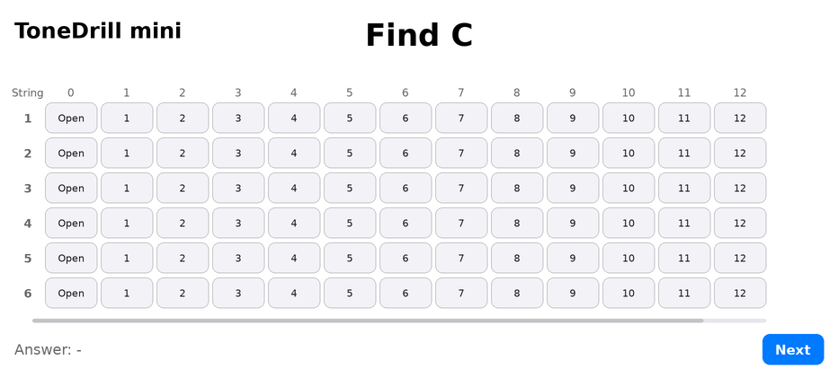

<!--
【MEMO】
■ タグの選択
tagsは最大4つまでなので、以下の中から必要なタグを選択する。,区切りで記述する。
beginners, devjournal, webdev, swift , security
-->

## 🗓️ This Week

- I had **less time to work on my personal projects** this week😅, but **I was still able to make some progress** on both my iOS app and web development projects🚼.
- One reason I was able to keep moving forward was that **I used ChatGPT and Codex to work more efficiently**. This week reminded me **how helpful AI can be for personal development projects**🦾.
- I continued **refining the UI direction for ToneDrill mini**, the minimum-feature iOS app I implemented in Xcode last week.
- Last week, I was excited to build the basic functionality of a working minimum-feature app in Xcode. This week, I shifted my focus to **creating a clearer UI image** for the app🎯.
- I was not sure how to approach the UI design at first, but after discussing it with AI, I decided on a direction. I would like to keep using [this approach](#ios-swiftui) as a base going forward🐎.
- For web development, I **finished reviewing the implementation of the portfolio site** that Codex created last week❤️‍🔥.
- I gained a better understanding of **shadcn/ui** and realized how convenient it is for building consistent UI components.
- I was not able to work on TryHackMe this week, so I would like to make time for it again next week.

> I also want to thank everyone who commented on my previous [Weekly Dev Log 2026-W11](https://dev.to/umitomo-lab/weekly-dev-log-2026-w11-4ga6)✨
>
> Reading the comments on my previous Weekly Dev Log made me feel that I would also like to try writing standalone articles that go deeper into what I learned.
>
> I hope I can share my honest learning process and thoughts in different formats, not only through Weekly Dev Logs.
>
> Also, thank you so much for leaving positive comments on my personal, honest Weekly Dev Logs!
>
> I always appreciate your comments, so please feel free to leave one if you have any thoughts or feedback.

---

## 📱 iOS (SwiftUI)

- I used Codex and Figma to create the UI design for the minimum version of ToneDrill mini.
- I asked Codex to generate **several UI design ideas**, then chose the one I liked and **organized it as a design file in Figma**.
- ToneDrill mini will have multiple screens in the future, but I focused on designing **only one main interaction screen** first.
- I started **organizing a Mini Design System** based on that one screen so that future screens can have a consistent UI.
- At first, I considered organizing the design rules in a text file like `Design.md`, but I decided to **organize them visually in Figma instead**.
- I organized the basic color structure, including background colors, text colors, button colors, and typography rules.

### 🎸 ToneDrill mini UI Image

Here are **two UI images** of ToneDrill mini: the current UI before creating the Figma design, and the temporary UI direction I created this week using Codex and Figma🥰.

I am excited to start implementing the app based on this new UI image🔥

_(Current ToneDrill mini UI screenshot)_

_(ToneDrill mini UI screenshot decided this week)_

---

## 🌐 Web Development

- Posted my weekly dev log on Dev.to 📝.
- Reviewed the structure of the portfolio home page created with React Router v7.

---

## 🔐 Security (TryHackMe)

- I was not able to work on TryHackMe this week. I would like to make time for it again next week!

---

# 💡 Key Takeaways

## 📱 SwiftUI Learning

- I noticed that if I ask Codex to create UI designs each time without clear rules, the colors, spacing, and font sizes can easily become inconsistent.
- I learned that it is better to create one **base UI design** first, then **organize the frame structure and Mini Design System** based on that design.
- I also considered asking Codex to implement a SwiftUI prototype first and then adjusting it in Xcode, but I felt that **organizing the UI visually in Figma first** was easier for me to understand.
- Having the UI structure and color roles visible in Figma made it easier to understand the design than organizing everything only in text.
- I learned that a visual design reference also makes it easier to imagine what needs to be changed after implementing the UI in SwiftUI.
- For a personal iOS app like this, I felt that it is better to start with a small set of design rules based on one screen, rather than trying to build a large design system from the beginning.

---

## 🌐 Web Development Learning

- Learned that `sticky top-0` keeps the sidebar content visible near the top of the screen while scrolling.
- Reviewed how Tailwind CSS utility classes are used to control layout in the profile sidebar.
- Learned that `flex flex-wrap` is useful for arranging small elements naturally and letting them wrap when space is limited.
- Learned that `flex` is better for content-sized inline groups, while `grid` is better for structured row-and-column layouts.
- Reviewed the shadcn/ui `Button` component and learned that `asChild` lets a child element, such as an `<a>` tag, receive the button styles while keeping its original HTML meaning.
- Rearned that this makes it possible to create a link that looks like a button, while still using the correct semantic element for navigation.
- Reviewed the official shadcn/ui `Button` documentation and learned how `asChild`, `variant`, and `size` help create consistent button UI patterns.
- Learned that shadcn/ui helps create consistent UI while allowing predefined design variations through component props, and its documentation makes it easy to understand how each prop affects the result.

---

# 🚀 Next Week

- Finish organizing the Mini Design System for ToneDrill mini in Figma.
- Organize the UI adjustment points for the portfolio site implemented by Codex in Notion, then start making small UI refinements.
- Continue working on the AI Security Learning Path.

---

# 🌈 Goals for This Year

## 📱 iOS (SwiftUI)

- Build a solid foundation in SwiftUI and create at least one iOS app.

## 🌐 Web Development

- Continue posting learning logs on Dev.to and eventually turn them into a portfolio site using React Router v7.

## 🔐 Security (TryHackMe)

- Continue learning cybersecurity on TryHackMe.
