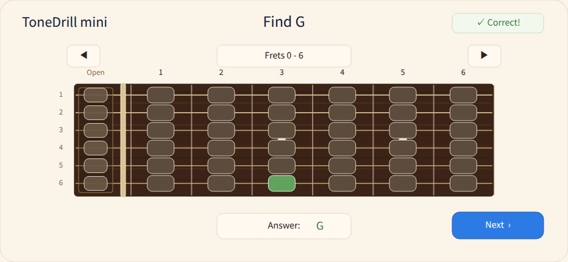
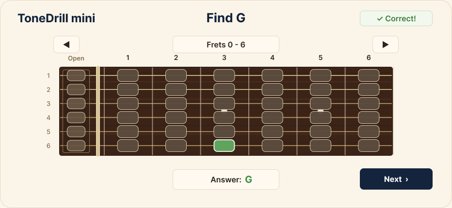

<!--
【MEMO】
■ タグの選択
tagsは最大4つまでなので、以下の中から必要なタグを選択する。,区切りで記述する。
beginners, devjournal, webdev, swift , security
-->

## 🗓️ This Week

- After several gloomy weeks of rain, summer suddenly arrived in Japan, and it lifted my mood! At the same time, work has been hot in more ways than one, so I have been trying to enjoy development efficiently with the limited time I have.
- This week, I worked on designing the top menu screen for my iOS app using the new workflow I built last week.
- I also created rule files and a task management document for my portfolio website project so that I can apply the same Codex workflow I built for iOS development to my web development project.
- Setting everything up took some effort, but now I can use a similar workflow for both iOS and web development, which made me feel much more organized.
- I also tried Penpot to see whether it could replace some of the design work I currently do in Figma, as I was reconsidering my Figma subscription.
- I thought Penpot was a great tool, but I decided to treat the cost of Figma as a necessary expense for now and focus on developing efficiently while still enjoying the process.
- I have not worked on TryHackMe for more than two weeks, so next week I want to at least reconnect with it, even if I only review the content briefly.

---

## 📱 iOS (SwiftUI)

- Used Codex to create the top menu screen design for ToneDrill in Figma.
- Used the workflow I built last week, where Codex first reads documents such as `AGENTS.md` and `TaskIndex.md` before starting the task.
- Followed a similar process to the previous implementation: first, I asked Codex to generate multiple UI design ideas as images.
- Chose the design I liked the most from those options and used it as the base direction.
- Organized the information needed to implement the selected design in Figma as `top-menu-figma-brief.md`.
- Organized the structure of the top menu screen in Figma based on the design created there.
- Decided to include menu buttons for features I want to implement in the future on the top menu screen as well. I designed them so that it is clear they are currently unavailable.
- Since this added a new “unavailable” state, I also organized the color rules for that state in the Figma design system.

---

## 🌐 Web Development

- Last week, I created a new Codex workflow for ToneDrill, my personal iOS development project. This week, I introduced a similar workflow to My New Portfolio Website, a personal web development project, by creating an `AGENTS.md` file and a dedicated task management file.
- To make the workflow easier to use, I reviewed both the immediate tasks and the medium- to long-term roadmap for My New Portfolio Website and organized them in the task management file.
- I also updated my Notion setup so that Codex can read and write project records through the Notion MCP integration.

---

## 🖼️ Design Tool Exploration

- Tried Penpot, an open-source design tool, to explore whether I can edit design data from Codex without using Figma’s Full Seat plan.
- Checked how Penpot works as a possible alternative to Figma for managing UI design data.
- Explored whether Penpot could fit into my AI-assisted design and development workflow.

---

# 💡 Key Takeaways

## 📱 SwiftUI Learning

- After reviewing and improving my workflow last week, I felt that Codex could work more smoothly because it had a better understanding of the task details and previous project context.
- I asked Codex to create multiple design ideas, and I chose a simple layout.
- I realized that when the UI structure is simple and does not rely on complex image editing or highly detailed visual parts, there is less gap between what I imagine and what the AI understands.
- Based on this, I felt that an efficient approach is to first use AI to build an app with a simple overall structure and the main features I want to use, then work on detailed UI refinements later.
- Since I am developing this app by myself alongside my full-time job, I realized that choosing what to focus on is very important.
- For now, I think it is better to prioritize finishing a simple working app, even if that means sacrificing advanced, complex, or visually impressive UI design at the beginning.

---

## 🌐 Web Development Learning

- Setting up this kind of workflow takes some time at first, but having a consistent way of working across different projects has reduced both the mental effort and the stress involved in switching between them.
- I had already been managing tasks for My New Portfolio Website in Notion, but aligning its task management structure with the one used for my iOS project made everything feel much more organized and easier to understand.
- Although the workflow is still relatively simple, I now have a basic and repeatable structure for using Codex in my personal development projects. As a result, I have a much clearer idea of how and when I want to use Codex than I did before.

---

## 🎨 What I Learned from Exploring Design Tools

### 💡 What I found

- Learned that Codex can read from and write to Penpot design files by using Penpot’s MCP server.
- I actually asked Codex to create a simple dashboard design in Penpot, then tested whether I could implement a web app based on that design. Through this, I confirmed that Codex can write design data to Penpot and that it is possible to implement a program based on a Penpot design.
- I also tested what differences would appear if I asked Codex to recreate the ToneDrill UI design I am currently working on in Figma as a similar design in Penpot.
- As a result, I found that it is possible to create a design in Penpot that is almost the same as the Figma design.

### 🖼️ Figma Design and Penpot Design

When I tested this workflow, the designs Codex actually created looked like this.

I was surprised that Penpot could recreate almost the same design!

_(Penpot Design)_

_(Figma Design)_

### 🐛 What I will do next

- Since I am already familiar with Figma, I still find it easier to use in terms of both workflow and usability. However, Penpot appears to support many of the core features I need, so it could be a good option for personal projects like mine.
- I considered switching from Figma to Penpot for the next screen in the ToneDrill project. However, I have already established a basic workflow for creating designs and implementing them with Codex and Figma while working on the first screen.
- Changing the workflow in the middle of the project could lead to unexpected issues and additional rework. Therefore, I decided to continue using Figma for the current ToneDrill project and focus on completing the app with the workflow I have already tested.
- Instead of introducing Penpot into ToneDrill immediately, I plan to create a separate small iOS project and use it to test a Penpot-based design and development workflow. I think it is more important to complete ToneDrill first and establish a reliable end-to-end workflow before experimenting with a different design tool.

---

# 🚀 Next Week

- Continue developing the top menu screen for ToneDrill.
- Organize the UI adjustment points for the portfolio site implemented by Codex in Notion, then start making small UI refinements.
- Continue working on the AI Security Learning Path.

---

# 🌈 Goals for This Year

## 📱 iOS (SwiftUI)

- Build a solid foundation in SwiftUI and create at least one iOS app.

## 🌐 Web Development

- Continue posting learning logs on Dev.to and eventually turn them into a portfolio site using React Router v7.

## 🔐 Security (TryHackMe)

- Continue learning cybersecurity on TryHackMe.
