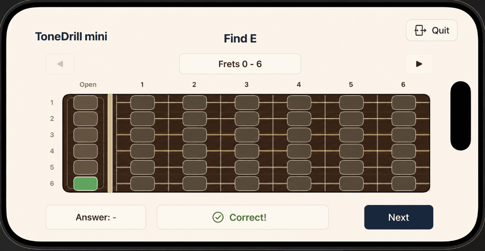
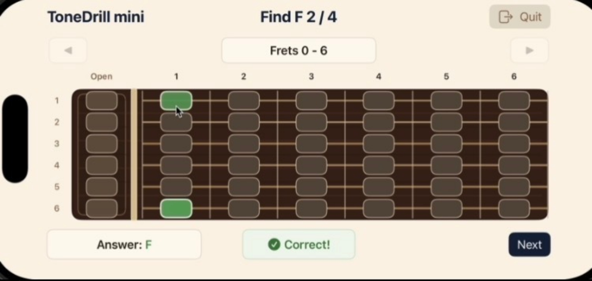

<!--
【MEMO】
■ タグの選択
tagsは最大4つまでなので、以下の中から必要なタグを選択する。,区切りで記述する。
beginners, devjournal, webdev, swift , security
-->

## 🗓️ This Week

- This is my first update in **two weeks**😂. I **took a long break** and enjoyed the summer with my family🎐.
- I was busy enjoying summer events, so I did not make much progress over the past two weeks. However, I was able to **make some progress on my iOS app**🐛.
- Until now, **Note Practice mode** asked users to **find just one position for a given note on the guitar fretboard**. During my break, I changed it so that users now need to **find all matching note positions within the visible fret range**🎸.
- With this update, the development of Note Practice mode is mostly complete. I have finally **finished developing one full practice mode**✨.
- While working on these changes, I also learned more about **how several parts of the SwiftUI implementation work**💡.

---

## 📱 iOS (SwiftUI)

- Changed Note Practice mode so that users now need to find all matching positions for the target note within the visible fret range instead of finding only one position.
- Added a progress indicator such as `Find E 2 / 4` to show how many correct positions have been found and how many remain.
- Replaced the previous single-selection state with a `Set<FretPosition>` so that multiple correct positions can remain highlighted without counting the same position twice.
- Added temporary `Correct!` and `Try Again` feedback after each answer while keeping previously found positions highlighted.
- Introduced a `FeedbackState` enum to manage idle, correct-feedback, and wrong-feedback states.
- Implemented a cancellable Swift concurrency `Task` to automatically clear temporary feedback after approximately one second.
- Added UUID-based token validation to prevent an older feedback Task from updating the UI after a newer answer has already been processed.
- Separated fret-answer interactions from fret-range navigation so that each type of control can be enabled or disabled independently.
- Added cancellation handling in `onDisappear` so that view-owned asynchronous work is stopped when the user leaves the practice screen.
- Used Xcode breakpoints to inspect `scheduleFeedbackReset()` at key points such as UUID generation, Task creation, `Task.sleep`, cancellation checks, token validation, and the final state reset.
- Reviewed the Codex-generated implementation against the official Apple and Swift documentation to better understand how SwiftUI state management, Tasks, cancellation, and view lifecycle behavior work.

### 🎸 How I Changed Note Practice Mode

Here is a more detailed look at what I changed in Note Practice mode.

Previously, the user only needed to find one correct position for the note shown in the question. With this update, the user now needs to find every position with the same note name within the currently visible fret range.

In the old version, the question was completed as soon as the user found one correct position. This meant that a user could answer correctly even if they had only memorized one specific position for that note on the fretboard.

In the new version, the user also needs to find where the same note appears on the other strings. The goal of this change was to encourage users to think about how the same note is distributed across the fretboard, rather than memorizing a single position for each note.

I also added a progress indicator that updates each time the user finds a correct position. Once all of the correct positions have been found, the app displays `Congratulations!` and moves on to the next question. This makes it easier for the user to see how many positions are still left to find before completing the question.

#### 🎵 Old Version

- Within a seven-fret range, the user only needed to find one position that matched the note shown in the question.
- The app checked whether the selected position was correct or incorrect and provided feedback to the user.

_(Old version: Note Practice mode)_

#### 🎶 New Version

- Within a seven-fret range, the user now needs to find every position that matches the note shown in the question.
- The app still checks each answer and provides feedback, but the number of correct answers now increases each time the user finds a new correct position.
- Once the number of correct answers reaches the total number of matching positions, the app displays `Congratulations!` and moves on to the next question.
- The goal of this change was to help users become more aware of how notes are arranged across the entire guitar fretboard instead of memorizing each note as a single isolated position.

_(New version: Note Practice mode)_

---

# 💡 Key Takeaways

## 📱 SwiftUI Learning

- I learned that an enum is a good way to model mutually exclusive UI states. Using `FeedbackState` means the screen can only be in one feedback state at a time, instead of relying on several Boolean properties that could accidentally conflict with one another.
- I learned that a `Set` is useful when I need to keep track of unique values. In this case, `Set<FretPosition>` prevents the same fret position from being counted more than once while still preserving multiple correct answers.
- I learned that application state and UI interaction state do not always need to be represented in the same way. A computed Boolean property such as `isRangeInteractionDisabled` can translate the current application state into a simple value that the view uses to enable or disable controls.
- I learned that `Task<Void, Never>?` can be used to keep a reference to an asynchronous Task that returns no value. Keeping that reference also allows the current feedback Task to be cancelled when necessary.
- I learned that Swift Task cancellation is cooperative rather than an immediate forced stop. Calling `cancel()` requests cancellation, but the Task still needs to check its cancellation state or reach a cancellation-aware suspension point such as `Task.sleep`.
- I learned why checking only Task cancellation may not always be enough. Comparing a UUID token captured by each Task with the latest `feedbackToken` provides an additional way to make sure that an older Task cannot clear newer UI state.
- I learned that `Task.sleep` suspends the current Task without blocking the underlying thread. This means the app and `MainActor` can continue processing other work while the feedback timer is waiting.
- I learned that asynchronous work owned by a view should be cancelled when that view disappears. Using `onDisappear` helps prevent a feedback Task from attempting to update state after the user has already left the practice screen.
- I learned that adding `Equatable` to a custom enum allows its values to be compared with operators such as `==` and `!=`. For example, `feedbackState != .idle` can be used to determine whether temporary feedback is currently being displayed.
- I learned that SwiftUI's `ButtonStyle` can affect the visual appearance of disabled controls, so interaction behavior and visual behavior should both be checked when disabling buttons.
- I learned that `.accessibilityElement(children: .combine)` can combine related child views into a single accessibility element, while `.accessibilityHidden(true)` can hide decorative elements from VoiceOver. These modifiers change the accessibility structure without changing the visual layout.
- By stepping through `scheduleFeedbackReset()` with Xcode breakpoints, I was able to see how UUID generation, `Task.sleep`, cancellation checks, token validation, and state reset work together instead of only understanding them from the source code.

---

# 🚀 Next Week

- Start developing Chord Tone Practice mode, another practice mode separate from Note Practice mode.
- Organize the UI adjustment points for the portfolio site implemented by Codex in Notion, then start making small UI refinements.
- Continue working on the AI Security Learning Path.

---

# 🌈 Goals for This Year

## 📱 iOS (SwiftUI)

- Build a solid foundation in SwiftUI and create at least one iOS app.

## 🌐 Web Development

- Continue posting learning logs on Dev.to and eventually turn them into a portfolio site using React Router v7.

## 🔐 Security (TryHackMe)

- Continue learning cybersecurity on TryHackMe.
