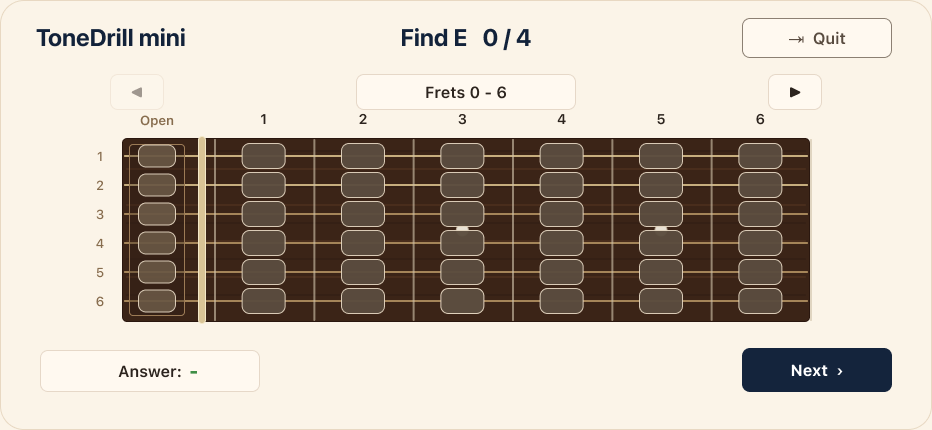

<!--
【MEMO】
■ タグの選択
tagsは最大4つまでなので、以下の中から必要なタグを選択する。,区切りで記述する。
beginners, devjournal, webdev, swift , security
-->

## 🗓️ This Week

- After all the hot weather we had up until last week, the days have suddenly turned much cooler. It finally feels like autumn is here🍂. Although I was busy this week, I think I was still able to use my time effectively and make steady progress on my iOS app📱.

- Last week, I finished reviewing the basic game rules for **Chord Tone Practice** and wrote that my next step would be to work on the UI. So this week, I mainly focused on designing the Chord Tone Practice screens in Figma🎨.

- One of my goals was to keep the basic practice experience consistent with **Note Practice**, which I had already designed and implemented earlier. The two modes share the same fretboard and basic screen structure, but Chord Tone Practice needs to display and manage more information because the player is looking for sets of three notes rather than a single note.

- What I especially liked about this process was that **I didn't have to redesign the whole practice screen from scratch**.

- When I designed Note Practice, I tried to keep the basic screen structure reusable because I already knew that I wanted to add more practice modes later. That decision helped a lot this week.

- Instead of reconsidering the fretboard layout, screen structure, navigation, and other common elements, I could focus on the parts that were unique to Chord Tone Practice💡.

- I also continued using **Codex and Figma together through MCP**. I could discuss possible layouts with Codex, immediately turn those ideas into visible designs in Figma, and then review and refine them using the actual screens as a shared reference.

- There are still some details that may change once I implement the design in SwiftUI, but the overall UI direction for Chord Tone Practice is now mostly settled🔥.

---

## 📱 iOS (SwiftUI)

- Designed the main UI for **Chord Tone Practice** based on the game rules finalized last week.
- Reused the basic Practice Screen structure originally created for **Note Practice**.
- Focused on the UI differences required for Chord Tone Practice instead of redesigning the entire screen.
- Added layouts for **Root, Quality, Pattern, and Progress**.
- Designed the main states for multiple-note selection, correct answers, wrong answers, multiple valid sets, and completion.
- Compared accessibility layouts and checked how longer note labels such as `C#/Db` would fit in compact UI elements.
- Used **Codex and Figma through MCP** to visualize, review, and refine UI ideas.

### 🎸 Comparing Note Practice and Chord Tone Practice

Here is a closer look at how I reused the Note Practice screen and what I added for Chord Tone Practice.

Both modes use the same main structure: the title and question information at the top, the fret-range controls and guitar fretboard in the center, and an answer area at the bottom. This helped me keep the overall practice experience consistent between the two modes.

However, the information needed to answer each question is different. Note Practice asks the player to find one type of note, while Chord Tone Practice asks the player to find three-note chord-tone patterns and may contain multiple valid sets within the visible fret range.

#### 🎵 Note Practice

- The player finds every position that matches one target note within the visible fret range.
- The header only needs to show the target note and the current progress, such as `Find E 0 / 4`.
- The player selects one position at a time, and each correct position remains highlighted.

_(Note Practice: finding all positions for a single note)_

#### 🎶 Chord Tone Practice

- The player finds chord-tone sets across three consecutive strings.
- The header needs to show the **Root**, **Quality**, **Pattern**, and **Progress** separately.
- The selected pattern may be `1-3-5`, `3-5-1`, or `5-1-3`, so the player needs to understand both the notes and their order.
- The screen also needs to manage temporary selections, correct and incorrect sets, previously discovered sets, and completion.
- I added a **Settings** button so that the player can change the Root and Chord Quality used for the practice session.

_(Chord Tone Practice: finding three-note chord-tone sets)_

The biggest visible change is the header. Instead of showing only a target note, Chord Tone Practice separates **Root**, **Quality**, **Pattern**, and **Progress** into four groups. At the same time, I was able to keep the fretboard, fret-range display, answer area, and overall visual style consistent with Note Practice.

Because I had designed the original screen with future practice modes in mind, I could spend more time on these feature-specific differences instead of designing the entire screen again from the beginning.

This process also showed me how useful the Codex and Figma workflow can be for UI design. When an idea from Codex was reflected in Figma, I could immediately see whether it worked visually. If something looked unclear or awkward, I could use the screen itself when discussing the next change. **Figma became a shared visual reference between Codex and me**, reducing the effort required to explain every visual difference using words alone.

---

# 💡 Key Takeaways

- Designing the original **Note Practice** screen with future practice modes in mind made it much easier to add Chord Tone Practice.
- Reusing a common UI structure allowed me to focus on the differences specific to the new feature.
- Comparing the two practice screens visually made it easier to see which parts could remain consistent and which parts needed to change.
- Seeing Codex's UI ideas directly in Figma helped me notice issues that would have been difficult to find from text descriptions alone.
- Using **Codex and Figma together through MCP** reduced the effort required to explain visual differences using words alone.
- Accessibility and longer labels need to be considered early, especially when adding more information to an already compact landscape layout.

---

# 🚀 Next Week

- Start implementing the backend logic for **Chord Tone Practice** and review the implementation.
- Organize the UI adjustment points for the portfolio site implemented by Codex in Notion, then start making small UI refinements.
- Continue working on the AI Security Learning Path.

---

# 🌈 Goals for This Year

## 📱 iOS (SwiftUI)

- Build a solid foundation in SwiftUI and create at least one iOS app.

## 🌐 Web Development

- Continue posting learning logs on Dev.to and eventually turn them into a portfolio site using React Router v7.

## 🔐 Security (TryHackMe)

- Continue learning cybersecurity on TryHackMe.
